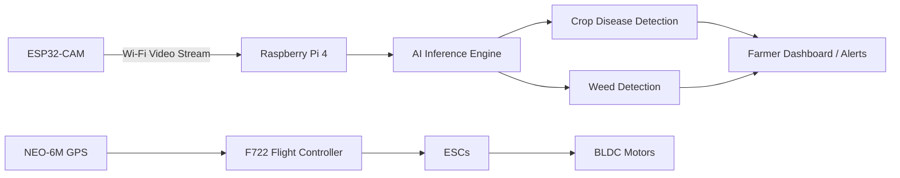

# FALCON
AI-powered agricultural drone built using ESP32, GPS, and embedded systems for precision farming.
## 
System Architecture

```mermaid
flowchart LR

    CAM[ESP32-CAM]
    PI[Raspberry Pi 4]
    AI[AI Inference Engine]
    DD[Crop Disease Detection]
    WD[Weed Detection]
    DASH[Farmer Dashboard / Alerts]

    GPS[NEO-6M GPS]
    FC[F722 Flight Controller]
    ESC[ESCs]
    MOTOR[BLDC Motors]

    CAM -->|Wi-Fi Video Stream| PI
    PI --> AI
    AI --> DD
    AI --> WD
    DD --> DASH
    WD --> DASH

    GPS --> FC
    FC --> ESC
    ESC --> MOTOR
```
