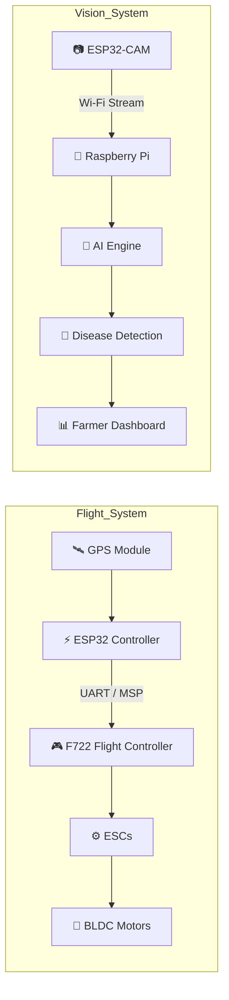

# 🚁 AgroSense

### AI-Powered Precision Agriculture Drone

Developed by **ArcNexus Labs**

*A student-led robotics & AI initiative*

### 👥 Co-Founders

**Aarush Pandit** • **Jeet Adatiya**

---

# 🌾 Overview

AgroSense is an intelligent agricultural drone developed to improve crop monitoring through embedded systems, computer vision, and edge AI.

The platform consists of two interconnected subsystems:

- **Flight Control** — ESP32 communicating with the F722 Flight Controller for navigation and control.
- **Vision System** — ESP32-CAM streaming live video to a Raspberry Pi for onboard AI inference.

---

# ✨ Features

- 🚁 ESP32-Controlled Flight System
- 📡 ESP32 ↔ F722 Communication
- 🛰 GPS Navigation
- 📷 ESP32-CAM Live Streaming
- 🍓 Raspberry Pi Edge Computing
- 🌱 AI Crop Disease Detection
- ⚡ Modular Embedded Architecture

---

# 🏗️ System Architecture

---

# 🛠 Hardware

| Component | Function |
|-----------|----------|
| ESP32 | Main Controller |
| F722 FC | Flight Stabilization |
| ESP32-CAM | Video Streaming |
| Raspberry Pi 4 | AI Processing |
| GPS Module | Navigation |
| ESCs | Motor Control |
| BLDC Motors | Flight |
| LiPo Battery | Power |

---

# 💻 Software Stack

| Embedded | AI | Tools |
|----------|----|-------|
| Arduino | Python | Git |
| C++ | OpenCV | VS Code |
| ESP-IDF | TensorFlow Lite *(planned)* | Arduino IDE |

---

# 📈 Development Roadmap

- [x] Drone Assembly
- [x] ESP32 ↔ F722 Communication
- [x] ESP32-CAM Streaming
- [ ] Raspberry Pi AI Integration
- [ ] Crop Disease Detection
- [ ] Autonomous Navigation
- [ ] Field Trials

---

# 👥 Team

## ArcNexus Labs

ArcNexus Labs is a student-led engineering initiative focused on robotics, embedded systems, AI, and precision agriculture.

### Co-Founders

**Aarush Pandit**
**Jeet Adatiya**

### Mission

Building affordable intelligent robotic systems for agriculture and beyond.
