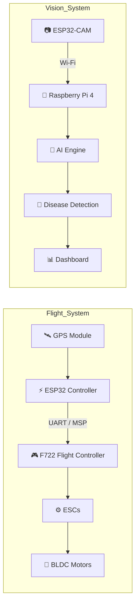

#  AgroSense

### *AI-Powered Precision Agriculture Drone*

*"Empowering Farmers Through Edge AI and Autonomous Robotics"*

---

---

# Overview

AgroSense is a next-generation precision agriculture platform that combines **embedded systems**, **computer vision**, and **edge AI** to assist farmers with intelligent crop monitoring.

The system is split into two independent subsystems:

**Flight Control** — ESP32 + F722

**Vision AI** — ESP32-CAM + Raspberry Pi

Together they enable autonomous data collection and real-time crop analysis.

---

# Features

-  Intelligent Flight Control
-  Live Wi-Fi Video Streaming
-  GPS Navigation
-  Edge AI Processing
-  Crop Disease Detection
-  Modular Embedded Architecture

---

# System Architecture

---

# 🛠 Hardware

| Component | Purpose |
|-----------|---------|
| ESP32 | Drone Controller |
| F722 FC | Flight Stabilization |
| ESP32-CAM | Live Video |
| Raspberry Pi 4 | Edge AI |
| GPS | Navigation |
| ESCs | Motor Control |
| BLDC Motors | Flight |
| LiPo Battery | Power |

---

# 💻 Software Stack

| Embedded | AI | Tools |
|----------|----|-------|
| C++ | OpenCV | Arduino IDE |
| Arduino | TensorFlow / YOLO *(Planned)* | Git |
| UART | Python | VS Code |

---

---

# 📈 Development Roadmap

- [x] Hardware Selection
- [x] Drone Assembly
- [x] ESP32 ↔ F722 Communication
- [x] ESP32-CAM Streaming
- [ ] Raspberry Pi AI Integration
- [ ] Disease Detection Model
- [ ] Autonomous Navigation
- [ ] Field Testing

---

# Vision
Our goal is to build an affordable autonomous drone capable of assisting farmers through **AI-powered crop monitoring**, reducing manual inspection time and enabling data-driven agricultural decisions.

---

### Built with passion by **ArcNexus Labs**

*"Engineering Tomorrow's Agriculture."*

